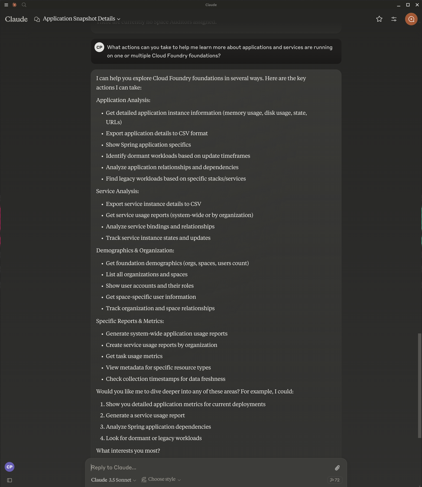

# cf-kaizen

## Getting started with Claude Desktop

* You're going to need to know of one or more API endpoints for cf-butler and/or cf-hoover application instance(s).
* Then you'll want to integrate one or multiple clients with Claude desktop via MCP client configuration that will consume an MCP server implementation.

### Prerequisites

* one or more [cf-butler](https://github.com/cf-toolsuite/cf-butler) and/or [cf-hoover](https://github.com/cf-toolsuite/cf-hoover) instance(s) deployed
  * take a look at the [deploy script](../scripts/deploy-on-tp4cf.sh) for how to build and deploy each of these instances
* the following CLIs/SDKs:
    * git
    * gh
    * java
    * mvn
    * (optionally) [sdk](https://sdkman.io/)
        * it might be the easiest way to install the Java SDK and Maven
* Claude Desktop
  * [Windows and Mac](https://claude.ai/download)
  * [Linux](https://github.com/wankdanker/claude-desktop-linux-bash)

### Building

```bash
cd /tmp
gh repo clone cf-toolsuite/cf-kaizen
cd cf-kaizen
mvn install
```

### Configuring Claude Desktop

Launch the desktop.

Add the following stanza(s) to a file called `claude_desktop_config.json`:

```json
"cf-kaizen-butler-client": {
  "command": "java",
  "args": [
    "-jar",
    "-Ddefault.url=<cf-butler-application-instance-api-endpoint>",
    "<path-to-project>/target/cf-kaizen-butler-server-0.0.1-SNAPSHOT.jar"
  ]
}
```

or

```json
"cf-kaizen-hoover-client": {
  "command": "java",
  "args": [
    "-jar",
    "-Ddefault.url=<cf-hoover-application-instance-api-endpoint>",
    "<path-to-project>/target/cf-kaizen-hoover-server-0.0.1-SNAPSHOT.jar"
  ]
}
```

> [!IMPORTANT]
> Replace occurrences of `<path-to-project>` and `<cf-kaizen-*-application-instance-api-endpoint>` above with appropriate values

Restart Claude Desktop instance.
Verify that you have a new set of tool calls available.
Chat with Claude.

