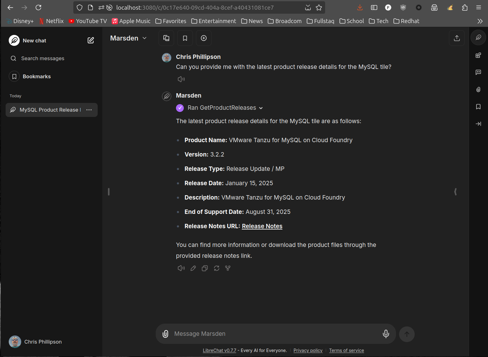

# cf-kaizen

## Getting started with LibreChat

* You're going to need to know of one or more API endpoints for cf-butler and/or cf-hoover application instance(s).
* Then you'll want to integrate one or both of the butler and hoover MCP servers (running locally or remotely)

### Prerequisites

* one or more [cf-butler](https://github.com/cf-toolsuite/cf-butler) and/or [cf-hoover](https://github.com/cf-toolsuite/cf-hoover) instance(s) deployed
    * take a look at the [deploy script](../scripts/deploy-on-tp4cf.sh) for how to build and deploy each of these instances
* the following CLIs/SDKs:
    * git
    * gh
    * java
    * mvn
    * (optionally) [sdk](https://sdkman.io/)
        * it might be the easiest way to install the Java SDK and Maven
* [LibreChat](https://www.librechat.ai/docs/quick_start/local_setup)

### Building

```bash
cd /tmp
gh repo clone cf-toolsuite/cf-kaizen
cd cf-kaizen
mvn install
```

### Configuring LibreChat

Clone the repository and initialize configuration based off the example

```bash
gh repo clone danny-avila/LibreChat
cd LibreChat
cp docker-compose.override.yml.example docker-compose.override.yml
cp librechat.example.yaml librechat.yaml
cp .env.example .env
```

Now, make sure the following configurations are in each file.

#### docker-compose.override.yml

Edit the file.  This should be the only content within the file, then save your changes.

```yaml
services:
  api:
    volumes:
      - type: bind
        source: ./librechat.yaml
        target: /app/librechat.yaml
```

#### librechat.yaml

Consult [MCP Servers Object Structure](https://www.librechat.ai/docs/configuration/librechat_yaml/object_structure/mcp_servers)

Edit the file.  Focus on the `mcpServers` stanza and make the additions as you see below, then save your changes.

```yaml
mcpServers:
  butler:
    # remote (update domain)
    # url: http://cf-kaizen-butler-server.apps.tas.z52772e75.shepherd.lease/sse
    # local
    url: http://localhost:8082/sse
    timeout: 120000
  hoover:
    # remote (update domain)
    # url: http://cf-kaizen-hoover-server.apps.tas.z52772e75.shepherd.lease/sse
    # local
    url: http://localhost:8084/sse
    timeout: 120000
```

Then start the UI

```bash
docker compose up -d
```

The UI will be accessible on http://localhost:3080

#### Configuring agents

// TODO

